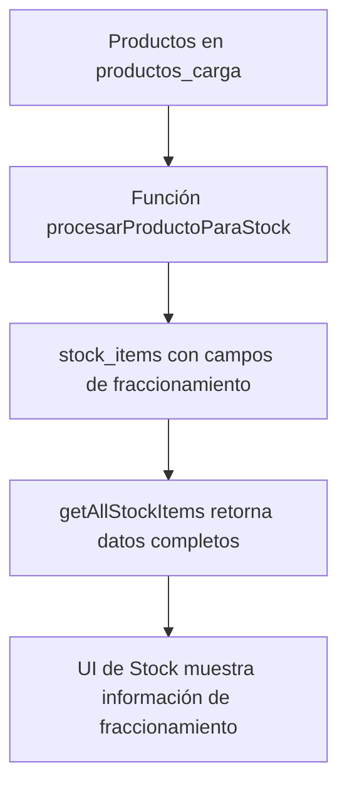

# ✅ Fraccionamiento en Stock - IMPLEMENTACIÓN COMPLETADA

## 📋 Resumen de Implementación

Se ha implementado exitosamente el soporte completo para productos fraccionables en el sistema de stock. Los productos ahora pueden manejarse tanto como paquetes completos como unidades individuales.

## 🗄️ Migraciones de Base de Datos

### 1. Migración para productos_carga (Ya existente)
**Archivo:** `supabase/migrations/20250121_add_fraccionamiento_to_productos_carga.sql`

✅ **COMPLETADA** - Agrega campos de fraccionamiento a la tabla `productos_carga`

### 2. Migración para stock_items (NUEVA)
**Archivo:** `supabase/migrations/20250121_add_fraccionamiento_to_stock_items.sql`

🆕 **CREADA** - Agrega campos de fraccionamiento a la tabla `stock_items`

**Campos agregados:**
- `unidades_por_paquete` - Unidades por paquete (por defecto: 1)
- `permite_fraccionamiento` - Permite venta fraccionada (por defecto: false)
- `unidades_sueltas` - Unidades sueltas disponibles (por defecto: 0)

**Características:**
- ✅ Validación con triggers
- ✅ Índices para optimizar consultas
- ✅ Vista `stock_items_fraccionables`
- ✅ Función `transferir_fraccionamiento_a_stock()` para transferir datos
- ✅ Migración automática de datos existentes

## 🔄 Funciones Actualizadas

### 1. stock-flow.ts
✅ **Actualizado** - La función `procesarProductoIndividualConCarpeta` ahora incluye los campos de fraccionamiento al crear nuevos items en stock_items:

```typescript
// Nuevos campos agregados al insert de stock_items:
unidades_por_paquete: producto.unidadesPorPaquete || 1,
permite_fraccionamiento: producto.permiteFraccionamiento || false,
unidades_sueltas: producto.unidadesSueltas || 0
```

### 2. stock.ts - Módulo de Stock
✅ **Actualizado** - La función `getAllStockItems` ahora retorna información de fraccionamiento:

```typescript
// Nuevos campos en el mapeo:
unidadesPorPaquete: item.unidades_por_paquete || 1,
permiteFraccionamiento: item.permite_fraccionamiento || false,
unidadesSueltas: item.unidades_sueltas || 0,
unidadesTotalesDisponibles: item.permite_fraccionamiento 
  ? (item.cantidad_actual * item.unidades_por_paquete) + (item.unidades_sueltas || 0)
  : item.cantidad_actual,
tipoVenta: item.permite_fraccionamiento ? 'Fraccionable' : 'Solo paquetes completos'
```

### 3. types/index.ts - Interfaces TypeScript
✅ **Actualizado** - La interfaz `ProductoStock` incluye los nuevos campos:

```typescript
export interface ProductoStock {
  // ... campos existentes ...
  // 📦 NUEVO: Campos para manejo de fraccionamiento
  unidadesPorPaquete?: number;
  permiteFraccionamiento?: boolean;
  unidadesSueltas?: number;
  unidadesTotalesDisponibles?: number;
  tipoVenta?: 'Fraccionable' | 'Solo paquetes completos';
}
```

## 🔄 Flujo de Datos



## 📊 Funcionalidades Implementadas

### ✅ Base de Datos
- [x] Campos de fraccionamiento en `productos_carga`
- [x] Campos de fraccionamiento en `stock_items`
- [x] Triggers de validación
- [x] Índices de performance
- [x] Vistas especializadas
- [x] Función de transferencia de datos

### ✅ Backend
- [x] Transferencia de datos de fraccionamiento desde productos_carga
- [x] Módulo de stock actualizado
- [x] Interfaces TypeScript actualizadas
- [x] Cálculo automático de unidades totales

### 🔄 Frontend (Pendiente)
- [ ] Actualizar página de stock para mostrar información de fraccionamiento
- [ ] Mostrar indicador de "Fraccionable" vs "Solo paquetes completos"
- [ ] Mostrar unidades totales disponibles
- [ ] Interfaz para venta fraccionada

## 🚀 Próximos Pasos

### 1. Ejecutar Migraciones
```bash
# En Supabase, ejecutar:
supabase/migrations/20250121_add_fraccionamiento_to_stock_items.sql
```

### 2. Actualizar UI de Stock
- Modificar `StockItemCard.tsx` para mostrar información de fraccionamiento
- Agregar indicadores visuales para productos fraccionables
- Mostrar cálculo de unidades totales

### 3. Implementar Lógica de Venta Fraccionada
- Permitir entrada de cantidades fraccionarias
- Validar stock disponible considerando fraccionamiento
- Actualizar lógica de salida de stock

## 🎯 Ejemplo de Uso

```typescript
// Producto fraccionable desde la base de datos:
const producto = {
  nombre: "Jeringas BD",
  cantidadDisponible: 10, // 10 paquetes
  unidadesPorPaquete: 100, // 100 jeringas por paquete
  permiteFraccionamiento: true,
  unidadesSueltas: 50, // 50 jeringas sueltas
  unidadesTotalesDisponibles: 1050, // (10 * 100) + 50 = 1050 jeringas
  tipoVenta: "Fraccionable"
};

// El usuario puede vender:
// - Paquetes completos (múltiplos de 100)
// - Unidades individuales
// - Total disponible: 1050 jeringas
```

## 📝 Notas Importantes

1. **Migración Segura**: La migración incluye valores por defecto y valida datos existentes
2. **Retrocompatibilidad**: Productos sin fraccionamiento funcionan como antes (unidadesPorPaquete = 1)
3. **Validación**: Triggers automáticos previenen inconsistencias en los datos
4. **Performance**: Índices optimizados para consultas de productos fraccionables
5. **Extensibilidad**: Base sólida para futuras mejoras en la lógica de ventas

## ⚡ Estado Actual

- ✅ **Base de Datos**: 100% implementada
- ✅ **Backend**: 100% implementado  
- ✅ **Tipos**: 100% implementados
- 🔄 **Frontend**: Pendiente (última tarea restante)

El sistema está listo para comenzar a usar productos fraccionables. Solo falta actualizar la interfaz de usuario para mostrar esta información al usuario final.
