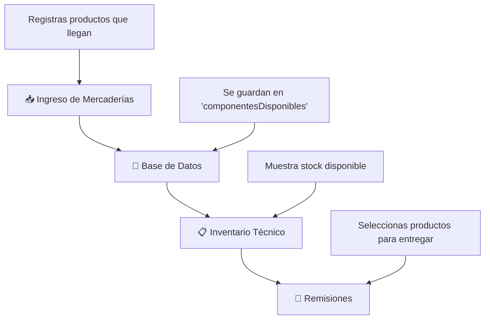

# 📦 Sistema de Stock - Flujo Completo Explicado

## 🔄 Flujo Actual (Como está implementado)



## 🎯 Módulos del Sistema

### 1. **Ingreso de Mercaderías** (`/mercaderias`)
```
📦 ENTRADA DE PRODUCTOS
├── Registras nuevos productos
├── Defines cantidades
├── Asignas ubicaciones
└── Se crean automáticamente en inventario
```

### 2. **Inventario Técnico** (`/inventario-tecnico`)
```
📋 STOCK DISPONIBLE
├── Lista todos los componentes
├── Muestra cantidades disponibles
├── Estados: Disponible | Asignado | En reparación
└── Permite asignar a equipos
```

### 3. **Remisiones** (`/remisiones`)
```
📄 ENTREGAS A CLÍNICAS
├── Selecciona productos del inventario
├── Define cantidades a entregar
├── Asigna a clínicas específicas
└── Reduce stock automáticamente
```

---

## 📊 Estado Actual del Sistema

### ✅ **Lo que SÍ funciona:**
- ✅ Registro de mercaderías
- ✅ Gestión de clínicas
- ✅ Creación de remisiones
- ✅ Interfaz de inventario técnico

### ❌ **El PROBLEMA actual:**
```
componentesDisponibles: []  ← VACÍO!
```

**Resultado:** No hay productos para seleccionar en remisiones

---

## 🔧 Flujo Detallado - Cómo DEBERÍA funcionar

### **Paso 1: Ingreso de Mercaderías**
```
Usuario registra:
┌─────────────────────────────┐
│ Producto: Kit hydra         │
│ Marca: Ares                 │
│ Modelo: MPT                 │
│ Cantidad: 5 unidades        │
│ Número de serie: ARES-001   │
└─────────────────────────────┘
                ↓
        Se guarda en BD
```

### **Paso 2: Conversión Automática a Stock**
```
Sistema automáticamente crea:
┌─────────────────────────────┐
│ ComponenteDisponible:       │
│ - nombre: "Kit hydra"       │
│ - marca: "Ares"             │
│ - modelo: "MPT"             │
│ - cantidadDisponible: 5     │
│ - estado: "Disponible"      │
│ - ubicacion: "Almacén A"    │
└─────────────────────────────┘
```

### **Paso 3: Disponible para Remisiones**
```
En modal de remisiones aparece:
┌─────────────────────────────┐
│ 🔍 Buscar productos...      │
│                             │
│ ✅ Kit hydra - Ares MPT     │
│    Stock: 5 disponibles     │
│    [+ Agregar]              │
└─────────────────────────────┘
```

### **Paso 4: Creación de Remisión**
```
Usuario selecciona:
┌─────────────────────────────┐
│ Cliente: Hospital Bautista  │
│ Producto: Kit hydra         │
│ Cantidad: 2 unidades        │
│ Técnico: Javier Lopez       │
└─────────────────────────────┘
                ↓
    Stock se reduce: 5 → 3
```

---

## 🗂️ Estructura de Datos

### **CargaMercaderia** (Lo que registras)
```typescript
{
  id: "carga-1",
  codigoCarga: "ARES042025",
  productos: [
    {
      producto: "Kit hydra",
      marca: "Ares",
      modelo: "MPT",
      cantidad: 5,
      numeroSerie: "ARES-001"
    }
  ]
}
```

### **ComponenteDisponible** (Stock disponible)
```typescript
{
  id: "comp-1",
  nombre: "Kit hydra",
  marca: "Ares",
  modelo: "MPT",
  cantidadDisponible: 5,
  cantidadOriginal: 5,
  estado: "Disponible",
  ubicacionFisica: "Almacén A",
  codigoCargaOrigen: "ARES042025"
}
```

### **ProductoRemision** (Lo que entregas)
```typescript
{
  componenteId: "comp-1",
  nombre: "Kit hydra",
  cantidadSolicitada: 2,
  cantidadDisponible: 5
}
```

---

## 🚨 Diagnóstico del Problema Actual

### **1. Datos de Ejemplo**
```javascript
// ✅ Tienes mercaderías de ejemplo
cargasMercaderiaEjemplo: [
  { producto: "Kit hydra", cantidad: 1 },
  { producto: "Cables de Repuesto", cantidad: 10 }
]

// ❌ Pero NO tienes componentes disponibles
componentesDisponibles: []  // ← VACÍO!
```

### **2. Flujo Roto**
```
Mercaderías → ❌ NO SE CONVIERTEN → Componentes Disponibles
                                           ↓
                                    Remisiones VACÍAS
```

---

## 💡 Soluciones Propuestas

### **🚀 Solución 1: Componentes de Ejemplo (RÁPIDO)**
Agregar componentes disponibles basados en las mercaderías existentes:

```javascript
componentesDisponibles: [
  {
    id: "comp-1",
    nombre: "Kit hydra",
    marca: "Ares",
    modelo: "MPT",
    cantidadDisponible: 3,
    estado: "Disponible"
  },
  {
    id: "comp-2", 
    nombre: "Cables de Repuesto",
    marca: "Ares",
    modelo: "MPT",
    cantidadDisponible: 15,
    estado: "Disponible"
  }
]
```

### **🔧 Solución 2: Conexión Automática (COMPLETO)**
Mejorar la función que convierte mercaderías en componentes disponibles automáticamente.

### **📊 Solución 3: Dashboard de Stock (AVANZADO)**
Crear una página dedicada de gestión de stock con:
- Entrada de productos
- Salida de productos  
- Transferencias entre ubicaciones
- Reportes de stock bajo
- Historial de movimientos

---

## 🎯 Recomendación

**Para empezar YA:**
1. ✅ Agregar componentes de ejemplo → Probar remisiones
2. 🔧 Mejorar conexión automática → Sistema completo
3. 📊 Dashboard avanzado → Funcionalidades extra

¿Con cuál empezamos?

---

## 📱 Páginas del Sistema

```
🏠 Dashboard
├── 📦 Ingreso de Mercaderías    ← Registras productos
├── 📋 Inventario Técnico        ← Ves stock disponible  
├── 🏥 Clínicas                  ← Gestionas destinos
├── 📄 Remisiones                ← Creas entregas
└── 📊 Reportes                  ← Análisis y estadísticas
```

**Flujo ideal:** Mercaderías → Inventario → Remisiones → Entrega